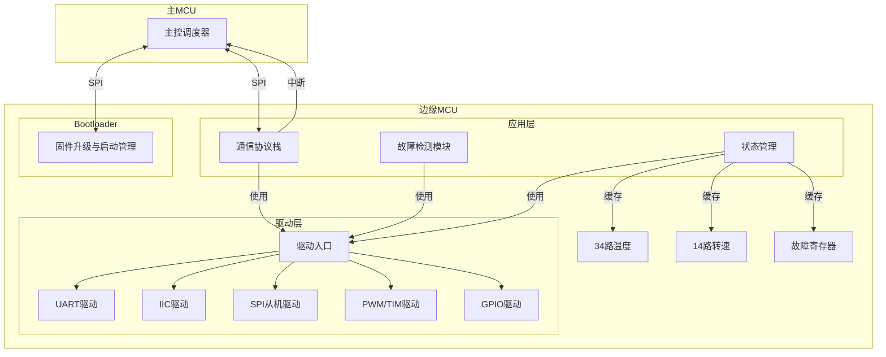
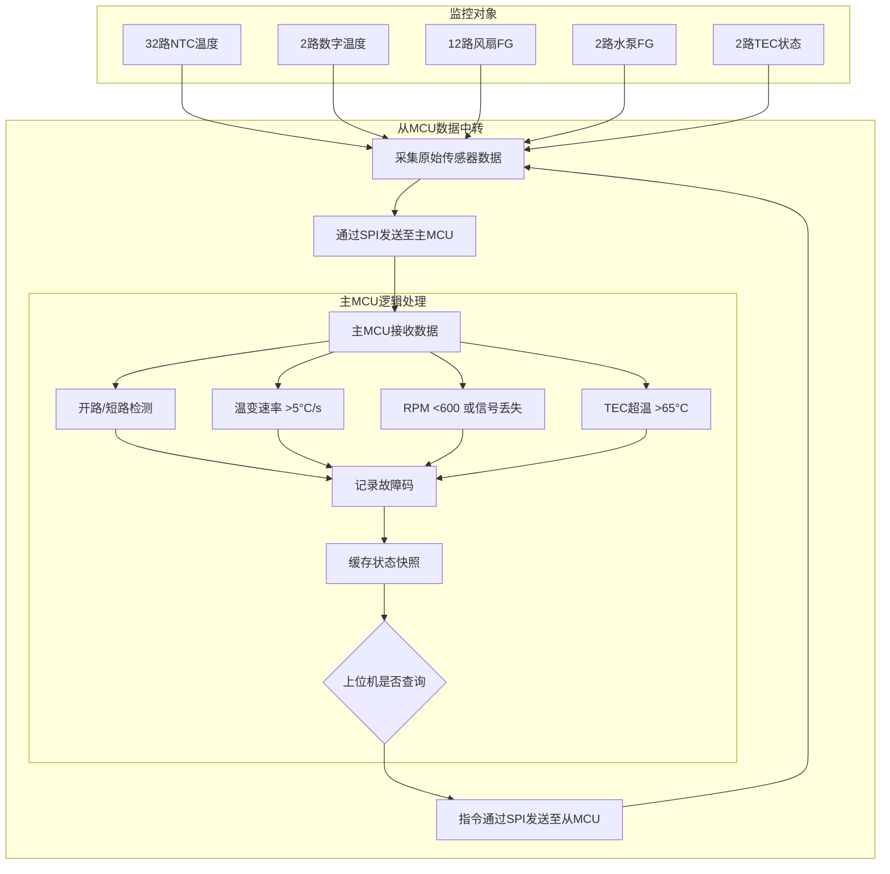
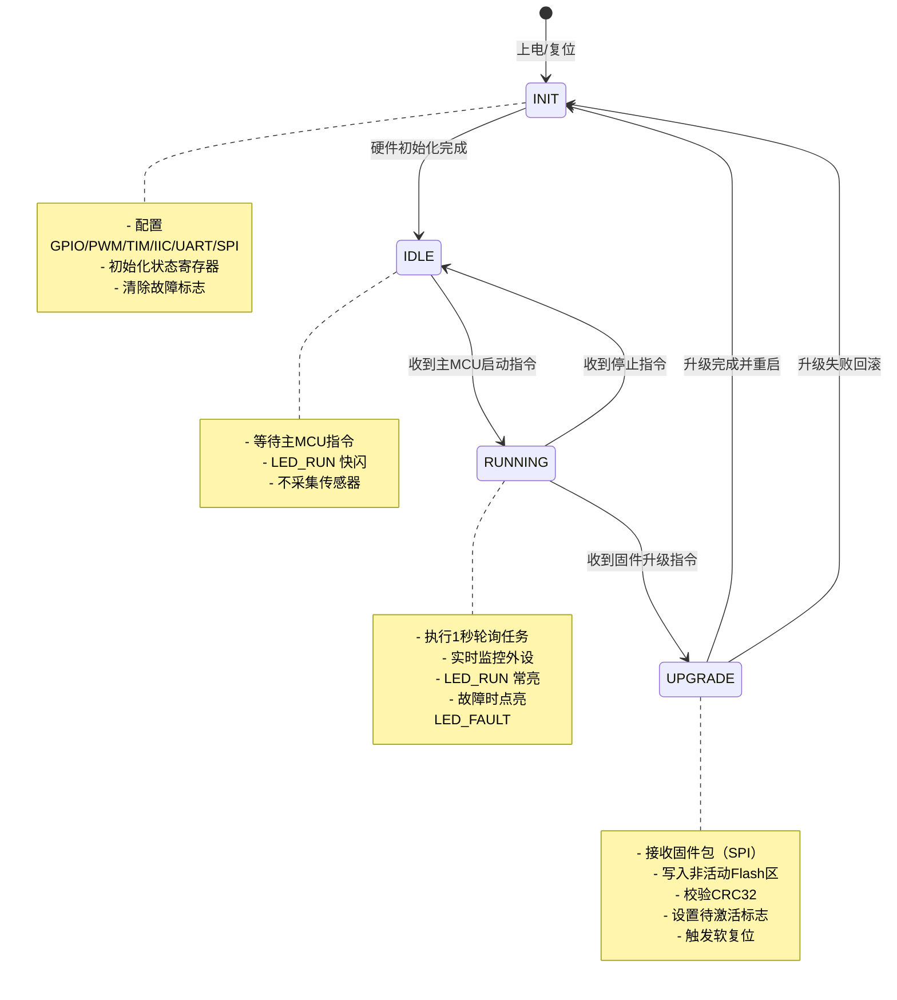
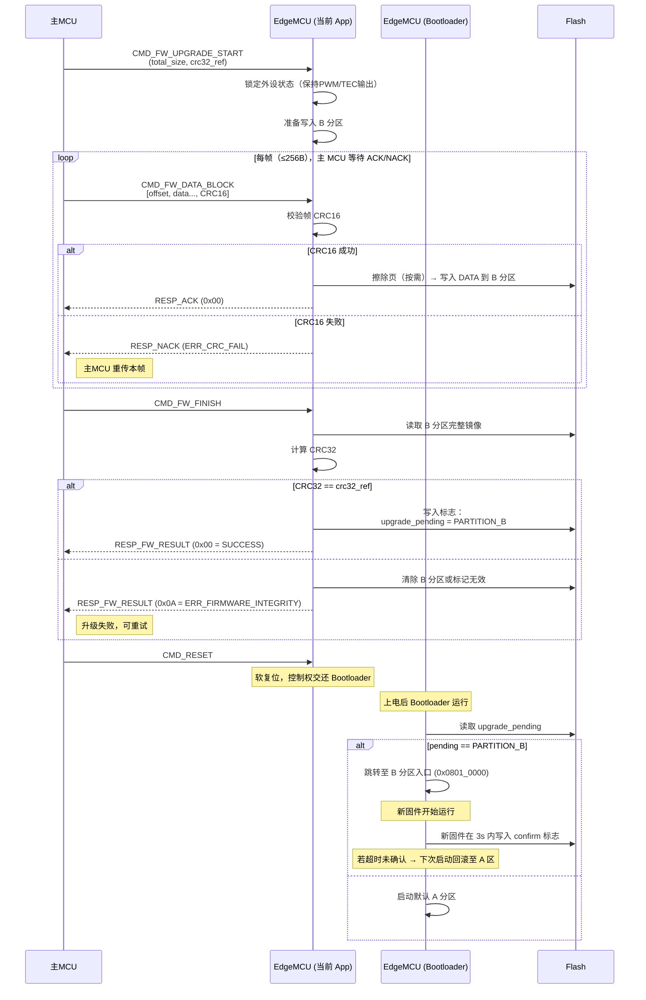
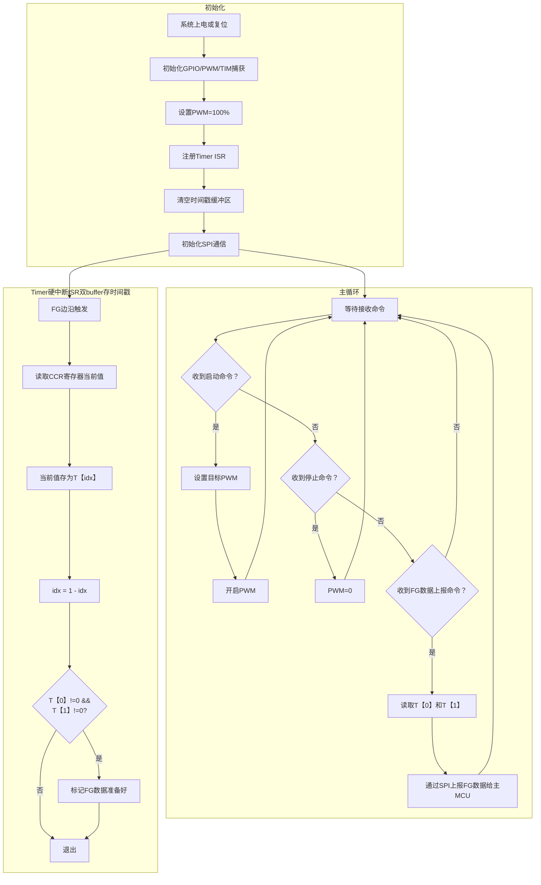
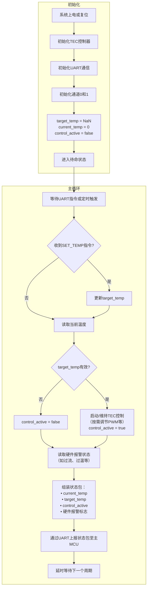
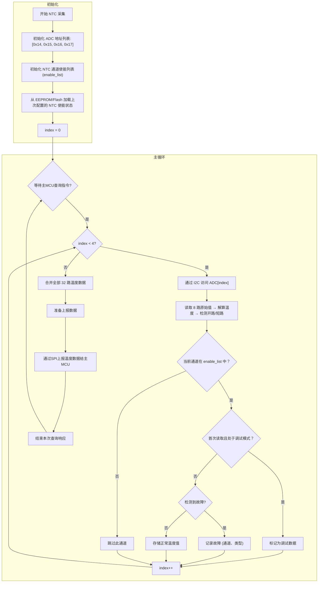
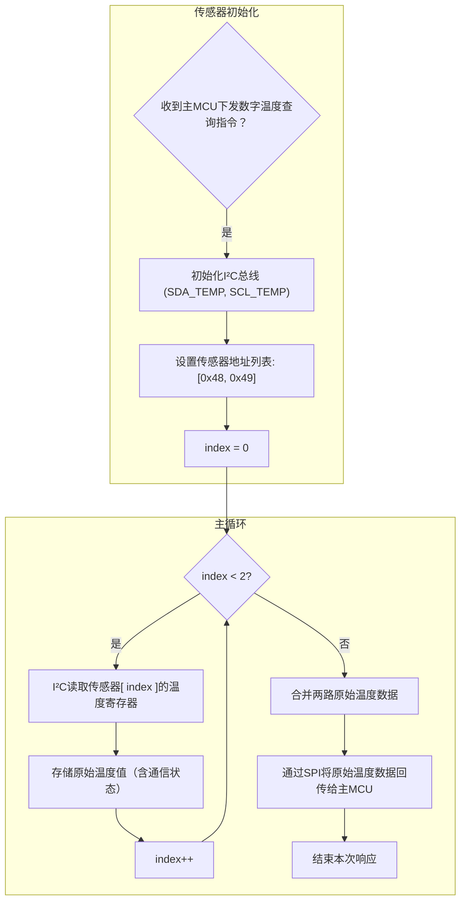
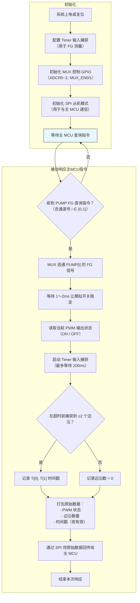

# 边缘MCU软件设计文档

## 1. 概述

本设计文档描述了用于环境控制系统的边缘微控制器（Edge MCU）的软件架构、模块划分、核心算法及运行机制。该MCU作为主MCU的从设备，负责对风扇、TEC、NTC传感器、水泵等执行机构进行驱动和数据采集，根据主MCU指令收发数据。

---

## 2. 软件架构

### 2.1 总体架构图

### 2.2 模块（函数）说明
| 模块类别   | 模块名称             | 功能描述                                                                 | 关键函数（C 语言风格）                                                                                                                                                                                                 | 依赖驱动            |
|------------|----------------------|--------------------------------------------------------------------------|-------------------------------------------------------------------------------------------------------------------------------------------------------------------------------------------------------------------------------------|---------------------|
| 驱动层     | Timer 输入捕获驱动   | 捕获 FG 信号周期，计算频率/RPM（TIM2_CH2 PA1）                           | `MX_TIM2_Init(void)` `HAL_TIM_IC_Start_IT(TIM_HandleTypeDef *htim, uint32_t Channel)` `HAL_TIM_IC_CaptureCallback(TIM_HandleTypeDef *htim)` `HAL_TIM_ReadCapturedValue(TIM_HandleTypeDef *htim, uint32_t Channel)` | TIM Input Capture HAL |
|            | GPIO 驱动            | 控制通用 IO 引脚，包括 LED、FG 信号输入等                                | `MX_GPIO_Init(void)` `HAL_GPIO_Init(GPIO_TypeDef *GPIOx, GPIO_InitTypeDef *GPIO_Init)` `HAL_GPIO_WritePin(GPIO_TypeDef *GPIOx, uint16_t GPIO_Pin, GPIO_PinState PinState)` `HAL_GPIO_ReadPin(GPIO_TypeDef *GPIOx, uint16_t GPIO_Pin)` | GPIO HAL            |
|            | PWM/TIM 驱动         | 输出 4 路独立 PWM（TIM3_CH1~CH4 用于 PUMP/FAN1/FAN2/FAN3），可配置频率/占空比 | `MX_TIM3_Init(void)` `MX_TIM4_Init(void)` `MX_TIM8_Init(void)` `FANPWM_SetDutyPercent(uint8_t duty_percent)` `HAL_TIM_PWM_Start(TIM_HandleTypeDef *htim, uint32_t Channel)` `__HAL_TIM_SET_COMPARE(TIM_HandleTypeDef *htim, uint32_t Channel, uint32_t compare)` | TIM HAL             |
|         | Timer 输入捕获驱动   | 捕获 FG 信号周期，计算频率/RPM（TIM2_CH2 PA1）                           | `MX_TIM2_Init(void)` `HAL_TIM_IC_Start_IT(TIM_HandleTypeDef *htim, uint32_t Channel)` `HAL_TIM_IC_CaptureCallback(TIM_HandleTypeDef *htim)` `HAL_TIM_ReadCapturedValue(TIM_HandleTypeDef *htim, uint32_t Channel)` | TIM Input Capture HAL |
|            | I²C 驱动             | 访问 TLA2528 ADC 进行 NTC 温度读取                                       | `MX_I2C_Init(void)` `TLA2528_WriteReg(uint8_t reg_addr, uint8_t data)` `TLA2528_ReadReg(uint8_t reg_addr, uint8_t *data)` `TLA2528_ReadADC(uint16_t *value, uint8_t *raw_bytes)` `TLA2528_TriggerConversion(void)` `TLA2528_ReadChannel(uint8_t channel, uint16_t *value, uint8_t *raw_bytes)` `HAL_I2C_Master_Transmit(I2C_HandleTypeDef *hi2c, uint16_t DevAddress, uint8_t *pData, uint16_t Size, uint32_t Timeout)` `HAL_I2C_Master_Receive(I2C_HandleTypeDef *hi2c, uint16_t DevAddress, uint8_t *pData, uint16_t Size, uint32_t Timeout)` `HAL_I2C_IsDeviceReady(I2C_HandleTypeDef *hi2c, uint16_t DevAddress, uint32_t Trials, uint32_t Timeout)` | I²C HAL             |
|            | UART 驱动            | 与 TEC 控制器通信（USART2）+ 调试打印（USART1）                          | `MX_USART1_UART_Init(void)` `MX_USART2_UART_Init(void)` `USART1_GetReceivedData(uint8_t *buffer, uint8_t size)` `USART2_GetReceivedData(uint8_t *buffer, uint8_t size)` `UART_SendString(const char *msg)` `UART_Printf(const char *format, ...)` `HAL_UART_Transmit(UART_HandleTypeDef *huart, uint8_t *pData, uint16_t Size, uint32_t Timeout)` `HAL_UART_Receive_IT(UART_HandleTypeDef *huart, uint8_t *pData, uint16_t Size)` `HAL_UART_IRQHandler(UART_HandleTypeDef *huart)` `HAL_UART_RxCpltCallback(UART_HandleTypeDef *huart)` | UART HAL            |
|            | SPI 驱动             | SPI 通信接口配置                                                         | `MX_SPI2_Init(void)` `HAL_SPI_Init(SPI_HandleTypeDef *hspi)`                                                                                                                                                                                 | SPI HAL             |
| 应用层     | 状态管理模块         | 缓存并更新所有传感器与执行器状态                                         | `state_update_temp_ntc(uint8_t ch, float temp)` `state_update_temp_digital(uint8_t ch, float temp)` `state_update_rpm(uint8_t dev_id, uint16_t rpm)` `state_update_tec_status(tec_id_t id, const tec_status_t *s)` `state_get_snapshot(system_state_t *out)` | 所有驱动            |
|            | 故障检测模块         | 实时检测各类故障，触发 WKP_INT                                           | `fault_check_fan_rpm(void)` `fault_check_ntc_validity(void)` `fault_check_tec_overtemp(void)` `fault_check_i2c_timeout(void)` `fault_update_global_flag(void)` | 状态管理 + GPIO 驱动 |
|            | 通信协议栈           | 解析 SPI 帧，处理指令/参数/固件                                          | `proto_parse_spi_frame(const uint8_t *frame, size_t len)` `proto_handle_cmd_query_state(void)` `proto_handle_cmd_set_pwm(const pwm_cfg_t *cfg)` `proto_handle_firmware_chunk(const fw_chunk_t *chunk)` `proto_build_response_ack(uint8_t cmd, uint8_t *buf, size_t *len)` | SPI 驱动 + 状态管理  |
| Bootloader | 固件升级与启动管理   | 双分区管理、CRC 校验、安全回滚                                           | `boot_check_active_partition(void)` `boot_validate_app_image(partition_t part)` `boot_switch_to_partition(partition_t part)` `boot_mark_boot_success(void)` `boot_rollback_if_needed(void)` | Flash 操作函数      |

### 2.3 流程图
#### 2.3.1 系统监控架构图

#### 2.3.2 状态机图

#### 2.3.3 固件升级机制
##### 文字版流程
1.主 MCU 发起升级请求
（1）发送 CMD_FW_UPGRADE_START 指令给当前运行的 App 程序（例如位于 A 分区）；
（2）App 程序收到后，准备接收新固件，并锁定关键外设状态（如保持风扇/PWM 输出不变）。
2.App 程序接收并写入新固件到 B 分区
（1）主 MCU 逐帧发送固件数据（每帧 ≤256 字节），包含 CRC16；
（2）App 程序（非 Bootloader）校验每帧 CRC16，成功则写入 Flash 的 B 分区（备份区）；
（3）写入完成后，主 MCU 发送 CMD_FW_FINISH，附带完整固件的 CRC32 参考值；
（4）App 程序从 B 分区读取完整镜像，计算 CRC32 并与参考值比对。
3.标记待激活状态
（1）若 CRC32 匹配 → App 程序在 Flash 的系统标志区写入指令：upgrade_pending = PARTITION_B;
若不匹配 → 清除 B 分区或标记为无效，返回错误。

##### 流程图

##### 备注
loop 是同步阻塞式传输（逐帧确认）：主 MCU 发一帧 → EdgeMCU 接收并处理 → 回应 → 主 MCU 发下一帧（边缘 MCU RAM资源有限）。
➤ 需要实时 ACK/NACK 控制流，避免主 MCU 过快发送导致溢出；
➤ 每帧校验（CRC16）：用于保证单帧传输完整性（防 SPI 噪声、丢字节）；
➤ 整体校验（CRC32）：用于验证整个固件镜像是否正确写入 Flash（分层校验是工业标准做法）；
➤App 程序处理所有升级帧，Bootloader 仅做启动选择；
➤App 程序写入 B 分区，Bootloader 只读标志；
➤全程在 App 中完成升级，复位后才进入 Bootloader。

---
## 3. 核心模块流程图
### 3.1 风扇控制模块流程图

### 3.2 TEC 控制模块流程图

### 3.3 温度采集模块流程图
#### NTC 采集流程

#### 数字温度传感器采集流程

### 3.4 水泵控制模块流程图

---
## 4. 指令定义和错误码
#### SPI帧格式
| 字段 | 长度 | 值/说明 |
|------|------|--------|
| 帧头（Sync Header） | 2 bytes | `0xA5 0x5A`（固定同步字，用于帧对齐） |
| 命令类型（CMD） | 1 byte | 指令类型，见下表 |
| 数据长度（LEN） | 1 byte | 数据载荷长度 N（0 ~ 255） |
| 序列号（SEQ） | 1 byte | 帧序号（0~255 循环），用于重传/丢包检测 |
| 数据载荷（DATA） | N bytes | 可变长度数据，内容由 CMD 决定 |
| 校验（CRC16） | 2 bytes | CRC-16 校验（覆盖从 CMD 到 DATA 的全部字节） |

#### 命令类型（CMD）定义
| CMD 值（Hex） | 名称 | 说明 |
|---------------|------|------|
| `0x01` | `CMD_PING` | 心跳检测。从 MCU 返回 1 字节状态：`0x00`=OK，`0x01`=BUSY，`0x02`=ERROR。 |
| `0x03` | `CMD_SET_FAN_PWM` | 设置风扇 PWM。参数：`[zone: uint8_t (0~2), duty: uint8_t (0~100)]`。从 MCU 返回 1 字节执行结果：`0x00`=成功，`0x01`=无效分区。 |
| `0x04` | `CMD_SET_PUMP_PWM` | 设置水泵 PWM。参数：`[pump_id: uint8_t (0~1), duty: uint8_t (0~100)]`。返回 1 字节结果：`0x00`=OK，`0x01`=ID 超限。 |
| `0x05` | `CMD_READ_STATUS` | 请求全系统状态快照。从 MCU 在本次 SPI 事务后续字节返回 固定长度结构体（约 200~256 字节），包含： • 32 路 NTC 温度（uint16_t ×32，单位 0.01°C） • 2 路数字温度（uint16_t ×2） • 12 路风扇 RPM（uint16_t ×12） • 2 路水泵 RPM（uint16_t ×2） • 2 路 TEC 状态（uint8_t ×2） • 故障位图（uint32_t） • 运行时间（uint32_t 秒） |
| `0x07` | `CMD_READ_FAULT_SNAPSHOT` | 读取故障快照（通常在主 MCU 检测到 INT 中断后调用）。从 MCU 返回 故障详情结构体（≤128 字节），包含： • 触发时间戳（uint32_t） • 故障源（如 FAN3 堵转） • 当前全部外设状态缓存 • 故障代码（enum） |
| `0x10` | `CMD_FW_UPGRADE_START` | 启动固件升级。参数：`[total_size: uint32_t]`。从 MCU 返回 1 字节：`0x00`=准备就绪，`0x01`=Flash 忙，`0x02`=空间不足。 |
| `0x11` | `CMD_FW_DATA_BLOCK` | 发送固件数据块。参数：`[offset: uint32_t, data: uint8_t[N]]`（N ≤ 248）。从 MCU 写入非活动分区后返回 1 字节：`0x00`=OK，`0x01`=CRC 错，`0x02`=写入失败。 |
| `0x12` | `CMD_FW_FINISH` | 结束升级并校验。从 MCU 执行 CRC32 校验、更新启动标志后返回 1 字节：`0x00`=成功待重启，`0x01`=校验失败，`0x02`=激活错误。 |
| `0x20` | `CMD_READ_CONFIG` | 读取配置参数区（8KB）。参数：`[addr_offset: uint16_t, len: uint8_t]`。从 MCU 返回 `len` 字节原始配置数据。 |
| `0x21` | `CMD_WRITE_CONFIG` | 写入配置参数。参数：`[addr_offset: uint16_t, data: uint8_t[N], crc16: uint16_t]`。从 MCU 验证 CRC 后写入 Flash，返回 1 字节：`0x00`=OK，`0x01`=CRC 错，`0x02`=写保护。 |
| `0xFF` | `CMD_RESET` | 软复位边缘 MCU。无参数。从 MCU 收到后立即复位（无返回，SPI 通信中断）。 |

#### 错误码定义

第一部分：通信协议错误码（单值，用于 ACK）
| 错误码 (Hex) | 符号常量 | 含义 | 处理建议 |
|-------------|---------|------|--------|
| `0x00` | `ERR_NONE` | 成功（无错误） | — |
| `0x01` | `ERR_INVALID_CMD` | 未知或不支持的命令 | 检查 CMD 是否在有效范围内 |
| `0x02` | `ERR_INVALID_PARAM` | 参数越界或非法（如 PWM>100、分区ID>2） | 校验参数合法性 |
| `0x03` | `ERR_CRC_FAIL` | 帧 CRC16 校验失败 | 重传当前帧 |
| `0x04` | `ERR_BUSY` | 设备忙（固件升级中、关键任务执行中） | 延迟后重试 |
| `0x05` | `ERR_FLASH_WRITE` | Flash 写入/擦除失败 | 检查供电、Flash 寿命；可尝试复位 |
| `0x08` | `ERR_NOT_IN_BOOTLOADER` | 非 Bootloader 模式下收到固件命令 | 先发送进入升级模式指令 |
| `0x09` | `ERR_FIRMWARE_SIZE` | 固件总大小超出 472KB 限制 | 使用适配的固件镜像 |
| `0x0A` | `ERR_FIRMWARE_INTEGRITY` | 固件 CRC32/签名校验失败 | 重新完整传输固件 |
| `0x0B` | `ERR_OPERATION_DENIED` | 操作被拒绝（安全锁定、调试禁止） | 解除安全策略或切换模式 |

第二部分：模块级故障位图（多比特，用于状态上报）
使用 32 位故障位图 fault_bitmap，按模块分段编码：
🔹 位 [31:24] —— 风扇故障（12 路，每路 2 bit）
每台风扇分配 2 bit，共 24 bit（实际用 24 bit，高位补 0）
编码：
00 = 正常
01 = 信号丢失（FG 无脉冲）
10 = 转速过低（<800 RPM）
11 = 保留（未来扩展）
示例：
fan_fault[0] = (fault_bitmap >> 30) & 0x3 → FAN0 状态
🔹 位 [23:22] —— 水泵故障（2 路，每路 2 bit）
PUMP0: bits [23:22]，PUMP1: bits [21:20]
编码：
00 = 正常运行
01 = 未启动（PWM=0 但应开启）
10 = 堵转/停转（FG 丢失或 RPM=0）
11 = 通信/控制异常
命名建议：300xy 中 x=PUMP0, y=PUMP1，但内部用位图更高效。
🔹 位 [19:16] —— TEC 故障（2 路，每路 2 bit）
TEC0: bits [19:18]，TEC1: bits [17:16]
编码：
00 = 正常
01 = 超温（>65°C）
10 = 温升速率异常（>5°C/s）
11 = UART 通信失败
🔹 位 [15:8] —— 温度传感器故障（8 bit，对应 8 个区域）
每 bit 对应一类传感器组：
bit15: 光源 NTC 异常（开路/短路/突变）
bit14: DMD 芯片 NTC 异常
bit13: 恒流源板 NTC 异常
bit12: 进风口 NTC 异常
bit11: 激光器 NTC 异常
bit10: 数字温度传感器 0 通信失败
bit9: 数字温度传感器 1 通信失败
bit8: 其他 NTC 通道异常
🔹 位 [7:0] —— 系统级故障
bit7: 看门狗复位发生
bit6: 电源电压异常（欠压/过压）
bit5: MUX 控制故障（CD4051 选通失败）
bit4: ADC 通信失败（I²C 超时/NACK）
bit3: UART（TEC）总线冲突
bit2: Flash 自检失败
bit1: Bootloader 启动回滚发生
bit0: 保留

---
## 5. 基于Keil5的代码目录
EdgeMCU_Project/
│
├── Core/                              # 核心启动与系统配置
│   ├── startup_gd32f30x_cl.s          # GD32F303 启动文件
│   └── system_gd32f30x.c              # 系统时钟初始化
│
├── Drivers/                           # 驱动层（含 CMSIS + GD32 官方库）
│   ├── CMSIS/                         # ARM Cortex-M4 通用核心支持
│   │   ├── core_cm4.h
│   │   ├── core_cm4_simd.h
│   │   ├── core_cmFunc.h
│   │   └── core_cmInstr.h
│   │
│   └── GD32F30x_StdPeriph_Driver/     # GD32 标准外设库
│       ├── inc/                       # 头文件：gd32f30x_gpio.h, gd32f30x_timer.h 等
│       └── src/                       # 源文件：gd32f30x_gpio.c, gd32f30x_timer.c 等
│
├── Board_Drivers/                     # 自定义板级驱动
│   ├── uart_drv.c / .h                # 基于 GD32 UART 外设封装
│   ├── iic_drv.c / .h                 # 基于 I2C 外设
│   ├── spi_drv.c / .h
│   ├── pwm_drv.c / .h                 # 基于 TIMER PWM 模式
│   ├── adc_drv.c / .h
│   ├── mux_ctrl.c / .h                # CD4051 控制
│   └── timer_capture.c / .h           # FG 信号捕获
│
├── App/                               # 应用逻辑层（与硬件解耦）
│   ├── main.c
│   ├── task_scheduler.c / .h
│   ├── state_manager.c / .h
│   ├── fan_control.c / .h
│   ├── tec_control.c / .h
│   ├── temp_sensor.c / .h
│   ├── pump_control.c / .h
│   ├── fault_handler.c / .h
│   └── comm_protocol.c / .h           # SPI 通信协议（主从交互）
│
├── Third_Party/                       # 第三方组件
│   └── crc16.c / .h                   # 软件 CRC16（或可替换为 GD32 CRC 外设驱动）
│
└── Output/                            # Keil 编译输出（自动生成）
    ├── Debug/
    └── Release/

