# 边缘MCU软件设计文档

## 1. 概述

本设计文档描述了用于环境控制系统的边缘微控制器（Edge MCU）的软件架构、模块划分、核心算法及运行机制。该MCU作为主MCU的从设备，负责对风扇、TEC、NTC传感器、水泵等执行机构进行驱动和数据采集，根据主MCU指令收发数据。

---


## 2. 软件架构

### 2.1 总体架构图
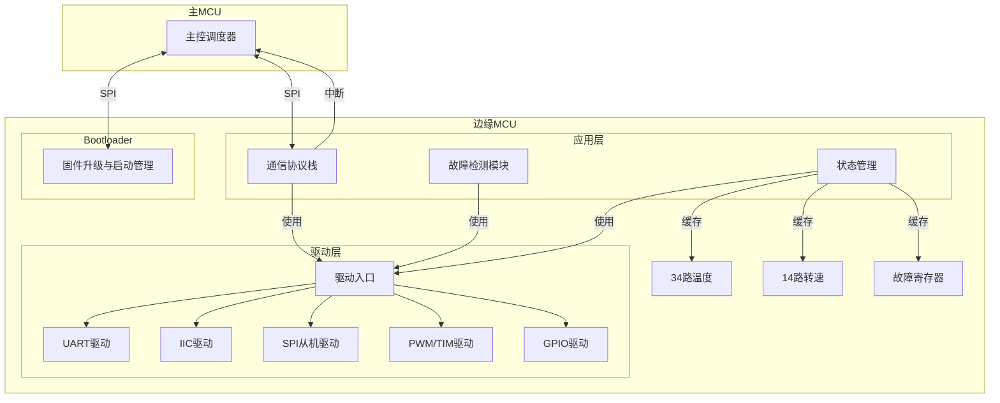


### 2.2 模块（函数）说明
| 模块类别   | 模块名称             | 功能描述                                                                 | 关键函数（C 语言风格）                                                                                                                                                                                                 | 依赖驱动            |
|------------|----------------------|--------------------------------------------------------------------------|-------------------------------------------------------------------------------------------------------------------------------------------------------------------------------------------------------------------------------------|---------------------|
| 驱动层     | Timer 输入捕获驱动   | 捕获 FG 信号周期，计算频率/RPM（TIM2_CH2 PA1）                           | `MX_TIM2_Init(void)`<br>`HAL_TIM_IC_Start_IT(TIM_HandleTypeDef *htim, uint32_t Channel)`<br>`HAL_TIM_IC_CaptureCallback(TIM_HandleTypeDef *htim)`<br>`HAL_TIM_ReadCapturedValue(TIM_HandleTypeDef *htim, uint32_t Channel)` | TIM Input Capture HAL |
|            | GPIO 驱动            | 控制通用 IO 引脚，包括 LED、FG 信号输入等                                | `MX_GPIO_Init(void)`<br>`HAL_GPIO_Init(GPIO_TypeDef *GPIOx, GPIO_InitTypeDef *GPIO_Init)`<br>`HAL_GPIO_WritePin(GPIO_TypeDef *GPIOx, uint16_t GPIO_Pin, GPIO_PinState PinState)`<br>`HAL_GPIO_ReadPin(GPIO_TypeDef *GPIOx, uint16_t GPIO_Pin)` | GPIO HAL            |
|            | PWM/TIM 驱动         | 输出 4 路独立 PWM（TIM3_CH1~CH4 用于 PUMP/FAN1/FAN2/FAN3），可配置频率/占空比 | `MX_TIM3_Init(void)`<br>`MX_TIM4_Init(void)`<br>`MX_TIM8_Init(void)`<br>`FANPWM_SetDutyPercent(uint8_t duty_percent)`<br>`HAL_TIM_PWM_Start(TIM_HandleTypeDef *htim, uint32_t Channel)`<br>`__HAL_TIM_SET_COMPARE(TIM_HandleTypeDef *htim, uint32_t Channel, uint32_t compare)` | TIM HAL             |
|         | Timer 输入捕获驱动   | 捕获 FG 信号周期，计算频率/RPM（TIM2_CH2 PA1）                           | `MX_TIM2_Init(void)`<br>`HAL_TIM_IC_Start_IT(TIM_HandleTypeDef *htim, uint32_t Channel)`<br>`HAL_TIM_IC_CaptureCallback(TIM_HandleTypeDef *htim)`<br>`HAL_TIM_ReadCapturedValue(TIM_HandleTypeDef *htim, uint32_t Channel)` | TIM Input Capture HAL |
|            | I²C 驱动             | 访问 TLA2528 ADC 进行 NTC 温度读取                                       | `MX_I2C_Init(void)`<br>`TLA2528_WriteReg(uint8_t reg_addr, uint8_t data)`<br>`TLA2528_ReadReg(uint8_t reg_addr, uint8_t *data)`<br>`TLA2528_ReadADC(uint16_t *value, uint8_t *raw_bytes)`<br>`TLA2528_TriggerConversion(void)`<br>`TLA2528_ReadChannel(uint8_t channel, uint16_t *value, uint8_t *raw_bytes)`<br>`HAL_I2C_Master_Transmit(I2C_HandleTypeDef *hi2c, uint16_t DevAddress, uint8_t *pData, uint16_t Size, uint32_t Timeout)`<br>`HAL_I2C_Master_Receive(I2C_HandleTypeDef *hi2c, uint16_t DevAddress, uint8_t *pData, uint16_t Size, uint32_t Timeout)`<br>`HAL_I2C_IsDeviceReady(I2C_HandleTypeDef *hi2c, uint16_t DevAddress, uint32_t Trials, uint32_t Timeout)` | I²C HAL             |
|            | UART 驱动            | 与 TEC 控制器通信（USART2）+ 调试打印（USART1）                          | `MX_USART1_UART_Init(void)`<br>`MX_USART2_UART_Init(void)`<br>`USART1_GetReceivedData(uint8_t *buffer, uint8_t size)`<br>`USART2_GetReceivedData(uint8_t *buffer, uint8_t size)`<br>`UART_SendString(const char *msg)`<br>`UART_Printf(const char *format, ...)`<br>`HAL_UART_Transmit(UART_HandleTypeDef *huart, uint8_t *pData, uint16_t Size, uint32_t Timeout)`<br>`HAL_UART_Receive_IT(UART_HandleTypeDef *huart, uint8_t *pData, uint16_t Size)`<br>`HAL_UART_IRQHandler(UART_HandleTypeDef *huart)`<br>`HAL_UART_RxCpltCallback(UART_HandleTypeDef *huart)` | UART HAL            |
|            | SPI 驱动             | SPI 通信接口配置                                                         | `MX_SPI2_Init(void)`<br>`HAL_SPI_Init(SPI_HandleTypeDef *hspi)`                                                                                                                                                                                 | SPI HAL             |
| 应用层     | 状态管理模块         | 缓存并更新所有传感器与执行器状态                                         | `state_update_temp_ntc(uint8_t ch, float temp)`<br>`state_update_temp_digital(uint8_t ch, float temp)`<br>`state_update_rpm(uint8_t dev_id, uint16_t rpm)`<br>`state_update_tec_status(tec_id_t id, const tec_status_t *s)`<br>`state_get_snapshot(system_state_t *out)` | 所有驱动            |
|            | 故障检测模块         | 实时检测各类故障，触发 WKP_INT                                           | `fault_check_fan_rpm(void)`<br>`fault_check_ntc_validity(void)`<br>`fault_check_tec_overtemp(void)`<br>`fault_check_i2c_timeout(void)`<br>`fault_update_global_flag(void)` | 状态管理 + GPIO 驱动 |
|            | 通信协议栈           | 解析 SPI 帧，处理指令/参数/固件                                          | `proto_parse_spi_frame(const uint8_t *frame, size_t len)`<br>`proto_handle_cmd_query_state(void)`<br>`proto_handle_cmd_set_pwm(const pwm_cfg_t *cfg)`<br>`proto_handle_firmware_chunk(const fw_chunk_t *chunk)`<br>`proto_build_response_ack(uint8_t cmd, uint8_t *buf, size_t *len)` | SPI 驱动 + 状态管理  |
| Bootloader | 固件升级与启动管理   | 双分区管理、CRC 校验、安全回滚                                           | `boot_check_active_partition(void)`<br>`boot_validate_app_image(partition_t part)`<br>`boot_switch_to_partition(partition_t part)`<br>`boot_mark_boot_success(void)`<br>`boot_rollback_if_needed(void)` | Flash 操作函数      |

### 2.4 系统复位与看门狗机制

#### 2.4.1 复位类型与内存影响

| 复位类型 | 触发原因 | RAM 数据 | Flash 数据 | 看门狗状态 | 说明 |
|----------|----------|----------|------------|------------|------|
| **上电复位 (POR)** | 电源上电/掉电 | 未定义 | 保持 | 重置 | 所有寄存器恢复默认值 |
| **系统复位 (SYSRESET)** | 软件触发 (SYSRESETREQ) | 未定义 | 保持 | 重置 | 包括 CMD_RESET 指令触发 |
| **独立看门狗复位 (IWDG)** | 计数器溢出 | 未定义 | 保持 | 重置 | 未喂狗超时触发 |
| **窗口看门狗复位 (WWDG)** | 计数器溢出/提前喂狗 | 未定义 | 保持 | 重置 | 喂狗窗口外操作触发 |
| **低功耗复位** | 从停止/待机模式唤醒 | 保持 | 保持 | 保持 | 仅部分寄存器恢复 |

**关键结论**：
- 所有看门狗复位（IWDG/WWDG）都会导致 **RAM 数据丢失**（未定义状态）
- Flash 数据保持不变（包括配置参数、固件、错误记录）
- 复位后需通过复位原因寄存器 (RCC_CSR) 判断复位类型

#### 2.4.2 复位原因记录机制

从 MCU 在 Flash 的系统标志区记录复位历史：

```
+------------------+------------------+------------------+
| 复位原因计数器   | 最近一次复位类型 | 最近一次复位时间 |
| (1 byte)         | (1 byte)         | (4 bytes)        |
+------------------+------------------+------------------+
| 复位历史记录缓冲区（最多 8 条记录）|
+------------------+------------------+------------------+
| 记录 [0]         | 记录 [1]         | ...              |
| - 复位类型 (1B)  | - 复位类型 (1B)  | ...              |
| - 时间戳 (4B)    | - 时间戳 (4B)    | ...              |
| - 看门狗状态 (1B)| - 看门狗状态 (1B)| ...              |
+------------------+------------------+------------------+
| 复位统计表（16 字节）|
+------------------+------------------+------------------+
| POR              | SYSRESET         | IWDG             | WWDG |
| - 次数 (4B)      | - 次数 (4B)      | - 次数 (4B)      | - 次数 (4B) |
+------------------+------------------+------------------+
```

##### 复位类型编码
| Value | 类型 | 说明 |
|-------|------|------|
| `0x01` | `RESET_POR` | 上电复位 |
| `0x02` | `RESET_SYS` | 系统复位 |
| `0x03` | `RESET_IWDG` | 独立看门狗复位 |
| `0x04` | `RESET_WWDG` | 窗口看门狗复位 |
| `0x05` | `RESET_PIN` | NRST 引脚复位 |
| `0x06` | `RESET_WKP` | 唤醒引脚复位 |
| `0x07` | `RESET_LPW` | 低功耗复位 |

##### 看门狗状态编码
| Value | 状态 | 说明 |
|-------|------|------|
| `0x00` | `WDT_NORMAL` | 正常运行（未触发复位） |
| `0x01` | `WDT_TIMEOUT` | 看门狗超时（未及时喂狗） |
| `0x02` | `WDT_EARLY` | 提前喂狗（窗口看门狗） |
| `0x03` | `WDT_DISABLED` | 看门狗已禁用 |

##### 复位原因查询流程
```
1. 系统启动后读取 RCC_CSR 寄存器获取复位标志
2. 判断复位类型并记录到 Flash 复位历史缓冲区
3. 主 MCU 通过 CMD_READ_STATUS 查询复位历史
4. 从 MCU 返回复位历史结构体（含统计表）
5. 主 MCU 解析复位原因，决定后续处理策略
```

#### 2.4.3 接收指令解析逻辑框图（队列缓冲异步）

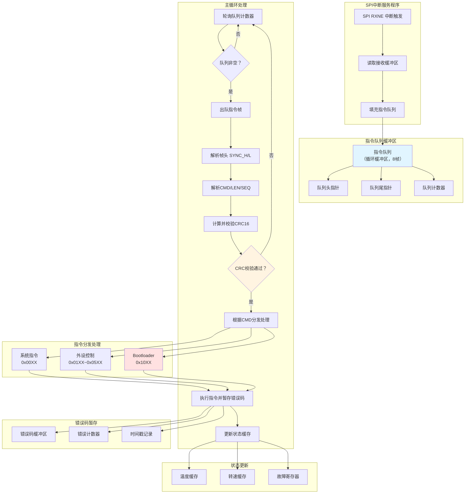


### 2.3 流程图
#### 2.3.1 系统监控架构图

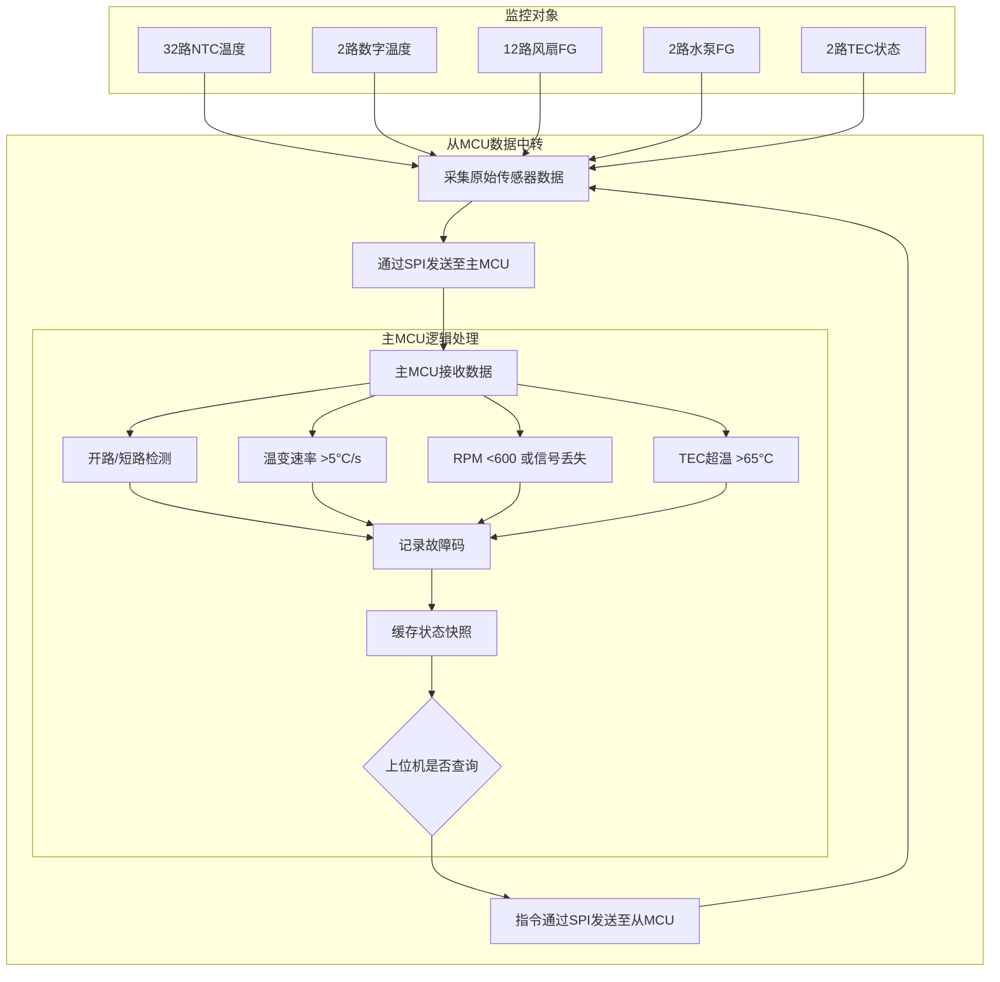


#### 2.3.2 状态机图
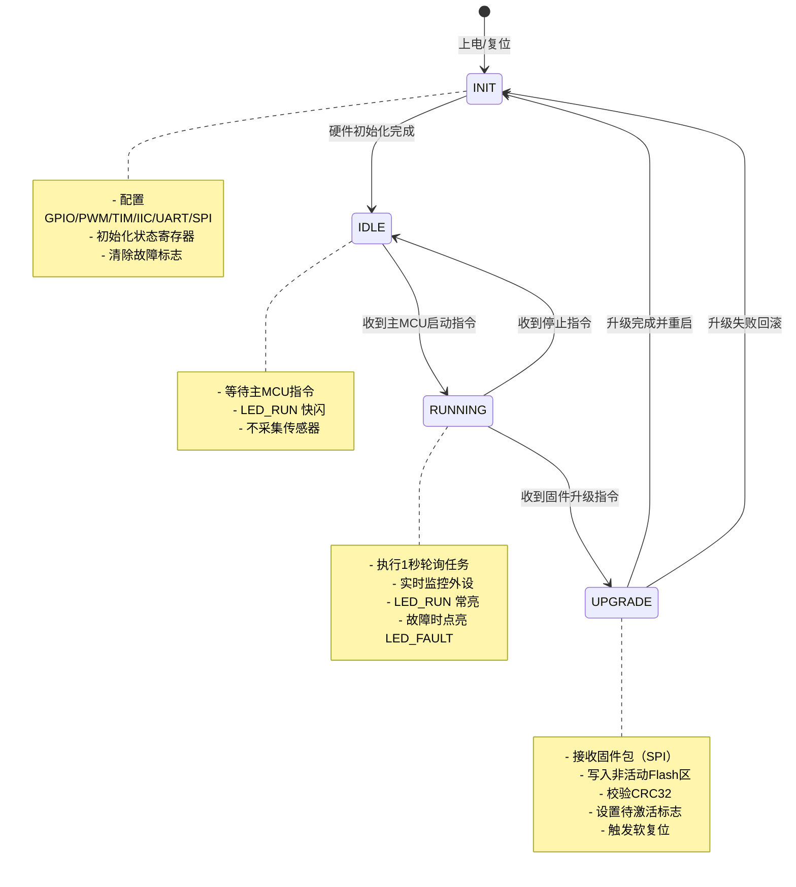

#### 2.3.3 固件升级机制
##### 文字版流程
1.主 MCU 发起升级请求
（1）发送 CMD_FW_UPGRADE_START 指令给当前运行的 App 程序（例如位于 A 分区）；
（2）App 程序收到后，准备接收新固件，并锁定关键外设状态（如保持风扇/PWM 输出不变）。
2.App 程序接收并写入新固件到 B 分区
（1）主 MCU 逐帧发送固件数据（每帧 ≤256 字节），包含 CRC16；
（2）App 程序（非 Bootloader）校验每帧 CRC16，成功则写入 Flash 的 B 分区（备份区）；
（3）写入完成后，主 MCU 发送 CMD_FW_FINISH，附带完整固件的 CRC32 参考值；
（4）App 程序从 B 分区读取完整镜像，计算 CRC32 并与参考值比对。
3.标记待激活状态
（1）若 CRC32 匹配 → App 程序在 Flash 的系统标志区写入指令：upgrade_pending = PARTITION_B;
若不匹配 → 清除 B 分区或标记为无效，返回错误。

##### 流程图

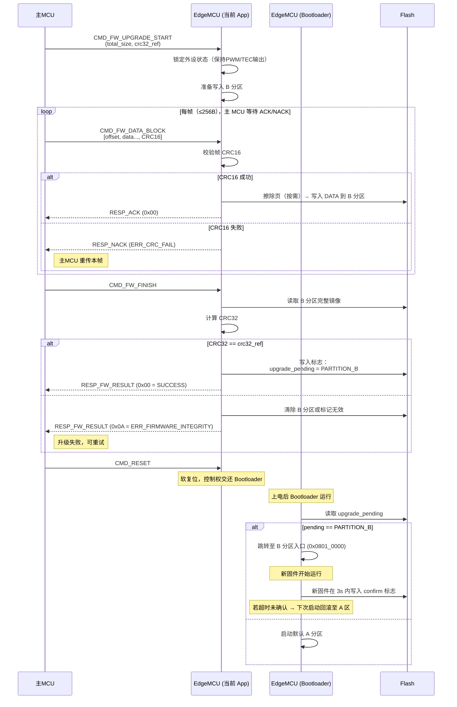

##### 备注
loop 是同步阻塞式传输（逐帧确认）：主 MCU 发一帧 → EdgeMCU 接收并处理 → 回应 → 主 MCU 发下一帧（边缘 MCU RAM资源有限）。
➤ 需要实时 ACK/NACK 控制流，避免主 MCU 过快发送导致溢出；
➤ 每帧校验（CRC16）：用于保证单帧传输完整性（防 SPI 噪声、丢字节）；
➤ 整体校验（CRC32）：用于验证整个固件镜像是否正确写入 Flash（分层校验是工业标准做法）；
➤App 程序处理所有升级帧，Bootloader 仅做启动选择；
➤App 程序写入 B 分区，Bootloader 只读标志；
➤全程在 App 中完成升级，复位后才进入 Bootloader。

---
## 3. 核心模块流程图
### 3.1 风扇控制模块流程图
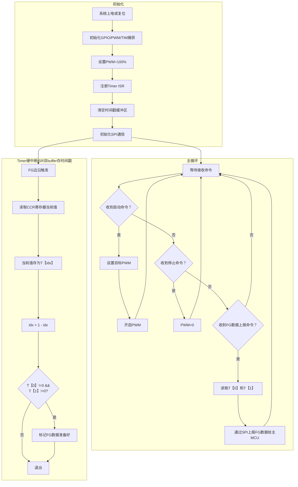

---

### 3.1.1 Simu_STM32F407_UDP_FAN_Temp 工程风扇控制流程图（参考设计）

#### 系统架构框图

```mermaid
graph TB
    %% === 输入层 ===
    subgraph 输入层
        T1[8路温度传感器<br/>ADS1115 ADC]
        T2[工作模式<br/>NORMAL/ECO/HI_ALT]
        T3[调试模式标志<br/>fan_dbg_mode]
    end

    %% === 控制核心层 ===
    subgraph 控制核心层
        C1[温度曲线选择器]
        C2[分段线性插值计算<br/>y = kx + b]
        C3[PWM限幅器<br/>40% ~ 100%]
        C4[偏移量补偿<br/>ECO:-15% / HI_ALT:+15%]
        C5[风扇组管理器<br/>2组独立控制]
    end

    %% === 输出层 ===
    subgraph 输出层
        O1[10路PWM输出<br/>TIM1/2/3/4]
        O2[FAN_GROUP_0<br/>3风扇绑定4温度]
        O3[FAN_GROUP_1<br/>2风扇绑定2温度]
    end

    %% === 监控层 ===
    subgraph 监控层
        M1[LOCKD信号检测<br/>Fan_LOCKED_check]
        M2[故障计数器<br/>Fan_TEST_count]
        M3[故障状态汇总<br/>Fan_Error_warn]
        M4[错误码上报<br/>FAN_Warning[2]]
    end

    %% 数据流
    T1 --> C1
    T2 --> C4
    C1 --> C2
    C2 --> C3
    C3 --> C4
    C4 --> C5
    C5 --> O2
    C5 --> O3
    O2 --> O1
    O3 --> O1
    
    O1 -.-> M1
    M1 --> M2
    M2 --> M3
    M3 --> M4
    
    T3 -.->|禁用自动控制| C5
```

#### 主控循环流程图（5秒周期）

```mermaid
graph TD
    %% === 主循环入口 ===
    A[loop_task_1000ms<br/>每秒执行] --> B{secondCounter % 5 == 0?}
    B -- 否 --> Z[返回]
    B -- 是 --> C{Work_Stat == 1?}
    C -- 否 --> Z
    C -- 是 --> D[初始化错误标志<br/>fan_err=0, temp_err=0]

    %% === 风扇堵转检测 ===
    D --> E[for i=1 to 8]
    E --> F[Fan_LOCKED_check]
    F --> G{检测完成?}
    G -- 否 --> E
    G -- 是 --> H[fan_err = Fan_Error_warn]

    %% === 温度采集与控制 ===
    H --> I[Get_Temperature<br/>读取ADS_Temp_Data[8]]
    I --> J[temp_err = Tempture_Erorr_Test]
    J --> K[fan_pwm_auto_set<br/>温度→PWM计算]

    %% === 错误上报 ===
    K --> L{fan_err || temp_err?}
    L -- 是 --> M[PJLink_StatusNotify_ErrorStatus<br/>上报故障]
    L -- 否 --> Z
    M --> Z
```

#### 自动温度控制流程图（fan_pwm_auto_set）

```mermaid
graph TD
    %% === 入口判断 ===
    A[fan_pwm_auto_set<br/>temp_array[8]] --> B{fan_dbg_mode == 1?}
    B -- 是 --> Z1[直接返回<br/>关闭自动控制]
    B -- 否 --> C{Projector_Model == Non_Model?}
    
    %% === 固定转速模式（当前执行分支） ===
    C -- 否 --> D1[固定转速模式]
    D1 --> D2{work_mode == HI_ALT?}
    D2 -- 是 --> D3[PWM = 100%]
    D2 -- 否 --> D4[PWM = 70%]
    D3 --> D5[FAN_PWM_Set<br/>设置所有风扇]
    D4 --> D5
    D5 --> Z2[返回]

    %% === 自动温度控制模式 ===
    C -- 是 --> E[自动温度控制模式]
    E --> F[计算组数<br/>group_num = sizeof/]
    F --> G[for i=0 to group_num]
    
    %% === 组内温度计算 ===
    G --> H[初始化max_temp=0]
    H --> I[for j=0 to temp_sensor_num]
    I --> J[读取温度<br/>temp_array[temp_idx]]
    J --> K{temp > max_temp?}
    K -- 是 --> L[max_temp = temp]
    K -- 否 --> M{遍历完成?}
    L --> M
    M -- 否 --> I
    
    %% === PWM计算 ===
    M -- 是 --> N[获取曲线<br/>curve_tbl[curve_idx]]
    N --> O[calc_fan_pwm<br/>y = kx + b + offset]
    O --> P[限幅处理<br/>40% ~ 100%]
    
    %% === PWM输出 ===
    P --> Q[for j=0 to fan_num]
    Q --> R[获取风扇索引<br/>fan_idx]
    R --> S[__HAL_TIM_SET_COMPARE<br/>设置PWM]
    S --> T{遍历完成?}
    T -- 否 --> Q
    T -- 是 --> U[记录日志<br/>log_info]
    U --> V{所有组完成?}
    V -- 否 --> G
    V -- 是 --> Z2
```

#### 堵转检测流程图（Fan_LOCKED_check）

```mermaid
graph TD
    %% === 入口 ===
    A[Fan_LOCKED_check<br/>sw = 1~8] --> B[Fan_Switch<br/>选择检测通道]
    B --> C[HAL_Delay 1ms<br/>模拟开关稳定]
    
    %% === 多次采样 ===
    C --> D[for i=0 to 10]
    D --> E[HAL_GPIO_ReadPin<br/>读取LOCKD状态]
    E --> F{i < 10?}
    F -- 是 --> D
    F -- 否 --> G{GPIO_PIN_SET?}
    
    %% === 故障判定 ===
    G -- 是 --> H[FAN_X_FLAG_COUNT++]
    H --> I{COUNT >= Fan_TEST_count?}
    I -- 否 --> Z[返回]
    I -- 是 --> J[FAN_X_FLAG = 1]
    J --> K[FAN_ErrorX_Buffer = Warn_Code]
    K --> L[Fan_Err |= bit_mask]
    L --> M[printf 故障信息]
    M --> Z
    
    %% === 正常恢复 ===
    G -- 否 --> N[FAN_X_FLAG = 0]
    N --> O[FAN_X_FLAG_COUNT = 0]
    O --> P[清除错误码]
    P --> Q[Fan_Err &= ~bit_mask]
    Q --> Z
```

---

### 3.1.2 两种设计方案对比分析

#### 架构差异对比

| 对比项 | 08 FAN_CTRL 工程（当前） | Simu_STM32F407_UDP_FAN_Temp 工程（参考） |
|--------|------------------------|----------------------------------------|
| **主控方式** | 被动响应式（从MCU） | 主动控制式（主MCU） |
| **控制触发** | 主MCU下发SPI命令 | 5秒周期定时自动执行 |
| **温度控制** | 无温度自动控制 | 支持分段温度曲线自动调节 |
| **风扇分组** | 无分组，独立控制 | 2组风扇，绑定不同温度传感器 |
| **转速计算** | 主MCU计算，从MCU仅执行 | MCU本地计算温度→PWM映射 |
| **堵转检测** | FG信号捕获计算RPM | LOCKD数字信号直接检测 |

#### 控制逻辑差异

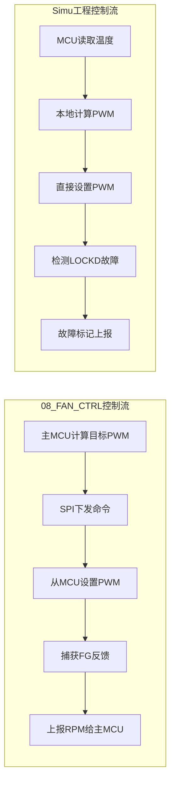

#### 关键逻辑异同点

**相同点：**
1. **PWM输出方式**：两者都使用 `__HAL_TIM_SET_COMPARE()` 设置PWM占空比
2. **多风扇支持**：都支持多路风扇独立控制
3. **故障检测**：都有风扇故障检测机制
4. **调试支持**：都支持调试模式或手动控制

**不同点：**

| 方面 | 08 FAN_CTRL | Simu工程 |
|------|-------------|----------|
| **转速检测方式** | FG信号输入捕获，计算RPM | LOCKD数字信号，直接判断堵转 |
| **控制周期** | 被动响应，无固定周期 | 5秒周期自动调节 |
| **温度关联** | 无温度控制逻辑 | 温度曲线自动映射PWM |
| **风扇分组** | 独立控制 | 分组管理，组内风扇同步 |
| **故障判定** | RPM < 600 判定故障 | 连续多次检测到LOCKD高电平 |
| **控制位置** | 主MCU决策 | MCU本地决策 |

#### 优缺点分析

**08 FAN_CTRL 方案优缺点：**
- ✅ 控制逻辑简单，主MCU集中决策
- ✅ 便于主MCU统一协调多个从设备
- ✅ FG信号可提供精确转速反馈
- ❌ 需要持续SPI通信，增加总线负载
- ❌ 无法实现温度自动闭环控制
- ❌ FG捕获需要复杂定时器配置

**Simu工程方案优缺点：**
- ✅ 温度自动闭环控制，响应及时
- ✅ 减少主从通信开销
- ✅ LOCKD检测简单可靠
- ✅ 风扇分组管理，策略灵活
- ❌ 控制逻辑复杂，占用MCU资源
- ❌ 主MCU无法实时干预（除非进入调试模式）
- ❌ 需要预置温度曲线参数

#### 改进建议

1. **融合两种方案优点**：
   - 保留08 FAN_CTRL的SPI命令响应能力
   - 增加Simu工程的温度自动控制模式（可选）
   - 支持主MCU切换"手动模式"和"自动模式"

2. **优化堵转检测**：
   - 当前FG捕获方案可提供精确RPM
   - 建议增加RPM阈值判断，低于阈值上报故障

3. **增加温度控制（可选扩展）**：
   - 从MCU本地采集温度（通过I2C读取NTC）
   - 实现简单的温度-PWM映射表
   - 主MCU可下发目标温度或温度曲线参数

### 3.2 TEC 控制模块流程图

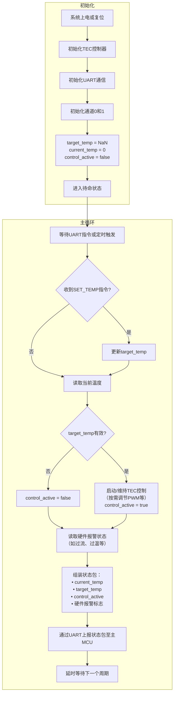

### 3.3 温度采集模块流程图
#### NTC 采集流程

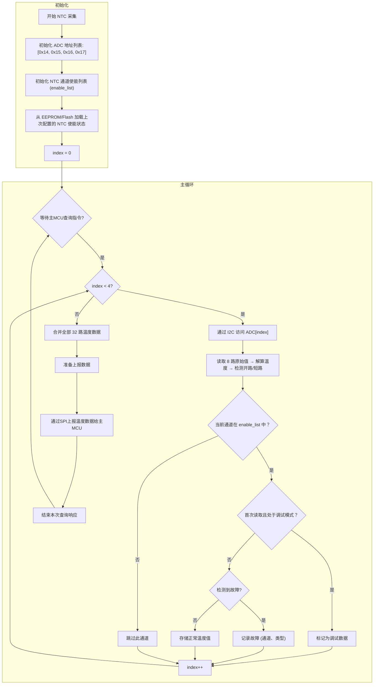

#### 数字温度传感器采集流程

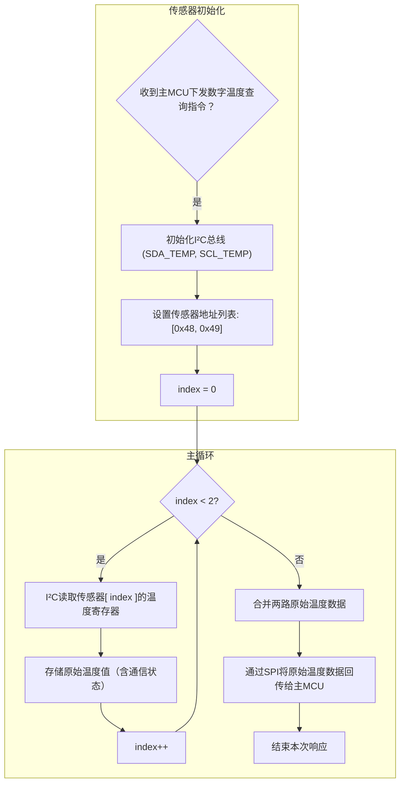

### 3.4 水泵控制模块流程图

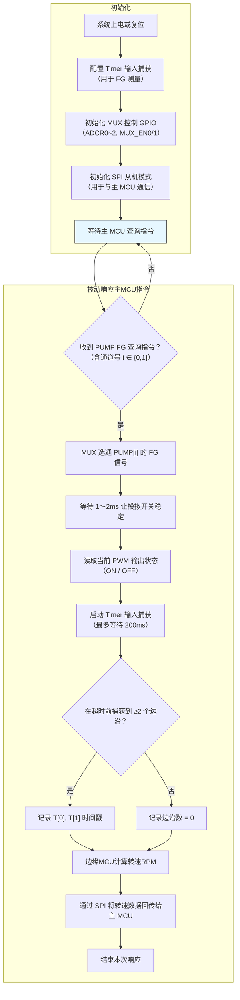

---
## 4. 指令定义和错误码
#### SPI帧格式
| 字段 | 长度 | 值/说明 |
|------|------|--------|
| 帧头（Sync Header） | 2 bytes | `0xA5 0x5A`（固定同步字，用于帧对齐） |
| 命令类型（CMD） | 2 bytes | 第1字节：外设/模块分类；第2字节：具体指令/功能 |
| 数据长度（LEN） | 1 byte | 数据载荷长度 N（0 ~ 255） |
| 序列号（SEQ） | 1 byte | 帧序号（0~255 循环），用于重传/丢包检测 |
| 数据载荷（DATA） | N bytes | 可变长度数据，内容由 CMD 决定 |
| 校验（CRC16） | 2 bytes | CRC-16 校验（覆盖从 CMD 到 DATA 的全部字节） |

#### 错误码反馈机制
边缘 MCU 采用两种错误码反馈机制，根据指令类型动态选择：

##### 同步反馈机制（Synchronous ACK）
适用于：**Bootloader 固件升级指令**（CAT_BOOTLOADER = 0x10）

特点：
- 每发送一帧指令，从 MCU 立即返回 1 字节 ACK/NACK
- 主 MCU 等待 ACK 后才发送下一帧（阻塞式传输）
- 保证固件传输的可靠性和顺序性

反馈格式：
```
ACK (0x00) = 指令执行成功
NACK (0xXX) = 错误码（高8位为模块分类，低8位为具体错误）
```

示例（固件升级流程）：
```
主 MCU → 边缘 MCU: CMD_FW_DATA_BLOCK [offset, data..., CRC16]
边缘 MCU → 主 MCU: ACK (0x00) 或 NACK (0x1004 = ERR_FW_CRC_FAIL)
主 MCU 收到 ACK 后发送下一帧，收到 NACK 后重传当前帧
```

##### 异步反馈机制（Asynchronous Error Buffer）
适用于：**外设初始化/配置指令**（CAT_FAN, CAT_PUMP, CAT_TEC, CAT_TEMP, CAT_CONFIG）

特点：
- 从 MCU 在执行指令时暂存错误码到内部缓冲区（不立即反馈）
- 主 MCU 统一轮询获取全部错误码（通过 CMD_READ_STATUS 或专用错误查询指令）
- 避免初始化过程中的阻塞，提高启动效率

错误码缓冲区结构（16 字节）：
```
+----------------+----------------+----------------+----------------+
| CAT_SYSTEM     | CAT_FAN        | CAT_PUMP       | CAT_TEC        |
| (4 bytes)      | (4 bytes)      | (4 bytes)      | (4 bytes)      |
+----------------+----------------+----------------+----------------+
| CAT_TEMP       | CAT_CONFIG     | CAT_BOOTLOADER | 保留           |
| (4 bytes)      | (4 bytes)      | (4 bytes)      | (4 bytes)      |
+----------------+----------------+----------------+----------------+
```

每个模块的 4 字节编码：
- bit [7:0]：最近一次错误码（低8位）
- bit [15:8]：错误计数器（累加该模块的错误次数）
- bit [23:16]：首次错误时间戳（秒）
- bit [31:24]：保留

主 MCU 查询流程：
```
1. 主 MCU 发送 CMD_READ_STATUS
2. 边缘 MCU 返回状态快照（含错误码缓冲区）
3. 主 MCU 解析各模块错误码
4. 根据错误类型决定处理策略（重试/告警/忽略）
```

##### 反馈机制选择规则
| 指令类型 | 反馈方式 | 说明 |
|----------|----------|------|
| Bootloader 固件升级（0x10XX） | 同步反馈 | 保证固件传输可靠性 |
| 配置参数写入（0x0502） | 同步反馈 | 确保配置正确写入 |
| 其他配置读取（0x0501） | 异步反馈 | 配置错误在下次写入时反馈 |
| 外设控制（0x01XX, 0x02XX, 0x03XX, 0x04XX） | 异步反馈 | 避免阻塞初始化流程 |

---

#### 命令类型（CMD）定义
CMD = (Category << 8) | Command<br>高8位（Category）：外设/模块分类<br>低8位（Command）：具体指令

##### 外设/模块分类（高8位）
| Category (Hex) | 模块名称 | 说明 |
|----------------|---------|------|
| `0x00` | `CAT_SYSTEM` | 系统级指令（通用指令） |
| `0x01` | `CAT_FAN` | 风扇控制模块 |
| `0x02` | `CAT_PUMP` | 水泵控制模块 |
| `0x03` | `CAT_TEC` | TEC 控制模块 |
| `0x04` | `CAT_TEMP` | 温度采集模块 |
| `0x05` | `CAT_CONFIG` | 配置参数模块 |
| `0x10` | `CAT_BOOTLOADER` | Bootloader 固件升级模块 |

##### 系统级指令（CAT_SYSTEM = 0x00）
| CMD (Hex) | 名称 | 说明 |
|-----------|------|------|
| `0x0001` | `CMD_PING` | 心跳检测。从 MCU 返回 1 字节状态：`0x00`=OK，`0x01`=BUSY，`0x02`=ERROR。 |
| `0x0002` | `CMD_READ_STATUS` | 请求全系统状态快照。从 MCU 在本次 SPI 事务后续字节返回 固定长度结构体（约 200~256 字节），包含：<br>• 32 路 NTC 温度（uint16_t ×32，单位 0.01°C）<br>• 2 路数字温度（uint16_t ×2）<br>• 12 路风扇 RPM（uint16_t ×12）<br>• 2 路水泵 RPM（uint16_t ×2）<br>• 2 路 TEC 状态（uint8_t ×2）<br>• 故障位图（uint32_t）<br>• 运行时间（uint32_t 秒） |
| `0x0003` | `CMD_READ_FAULT_SNAPSHOT` | 读取故障快照（通常在主 MCU 检测到 INT 中断后调用）。从 MCU 返回 故障详情结构体（≤128 字节），包含：<br>• 触发时间戳（uint32_t）<br>• 故障源（如 FAN3 堵转）<br>• 当前全部外设状态缓存<br>• 故障代码（enum） |
| `0x00FF` | `CMD_RESET` | 软复位边缘 MCU。无参数。从 MCU 收到后立即复位（无返回，SPI 通信中断）。 |

##### 风扇控制指令（CAT_FAN = 0x01）
| CMD (Hex) | 名称 | 说明 |
|-----------|------|------|
| `0x0101` | `CMD_SET_FAN_PWM` | 设置风扇 PWM。参数：`[zone: uint8_t (0~2), duty: uint8_t (0~100)]`。从 MCU 返回 1 字节执行结果：`0x00`=成功，`0x01`=无效分区。 |
| `0x0102` | `CMD_GET_FAN_RPM` | 获取风扇转速。参数：`[zone: uint8_t (0~2)]`。从 MCU 返回 2 字节 RPM 值（uint16_t）。 |
| `0x0103` | `CMD_GET_FAN_STATUS` | 获取风扇状态。参数：`[zone: uint8_t (0~2)]`。从 MCU 返回 1 字节状态：bit0=运行中，bit1=故障。 |

##### 水泵控制指令（CAT_PUMP = 0x02）
| CMD (Hex) | 名称 | 说明 |
|-----------|------|------|
| `0x0201` | `CMD_SET_PUMP_PWM` | 设置水泵 PWM。参数：`[pump_id: uint8_t (0~1), duty: uint8_t (0~100)]`。从 MCU 返回 1 字节结果：`0x00`=OK，`0x01`=ID 超限。 |
| `0x0202` | `CMD_GET_PUMP_RPM` | 获取水泵转速。参数：`[pump_id: uint8_t (0~1)]`。从 MCU 返回 2 字节 RPM 值（uint16_t）。 |
| `0x0203` | `CMD_GET_PUMP_STATUS` | 获取水泵状态。参数：`[pump_id: uint8_t (0~1)]`。从 MCU 返回 1 字节状态：bit0=运行中，bit1=故障。 |

##### TEC 控制指令（CAT_TEC = 0x03）
| CMD (Hex) | 名称 | 说明 |
|-----------|------|------|
| `0x0301` | `CMD_SET_TEC_TEMP` | 设置 TEC 目标温度。参数：`[tec_id: uint8_t (0~1), target_temp: int16_t (0.01°C)]`。从 MCU 返回 1 字节结果：`0x00`=OK，`0x01`=ID 超限。 |
| `0x0302` | `CMD_GET_TEC_STATUS` | 获取 TEC 状态。参数：`[tec_id: uint8_t (0~1)]`。从 MCU 返回 8 字节状态包：<br>• current_temp（int16_t，0.01°C）<br>• target_temp（int16_t，0.01°C）<br>• control_active（uint8_t）<br>• 硬件报警标志（uint8_t） |

##### 温度采集指令（CAT_TEMP = 0x04）
| CMD (Hex) | 名称 | 说明 |
|-----------|------|------|
| `0x0401` | `CMD_READ_NTC_TEMP` | 读取 NTC 温度。参数：`[channel: uint8_t (0~31)]`。从 MCU 返回 2 字节温度值（uint16_t，0.01°C）和 1 字节状态。 |
| `0x0402` | `CMD_READ_DIGITAL_TEMP` | 读取数字温度传感器。参数：`[sensor_id: uint8_t (0~1)]`。从 MCU 返回 2 字节温度值（uint16_t，0.01°C）和 1 字节通信状态。 |
| `0x0403` | `CMD_GET_TEMP_STATUS` | 获取温度模块状态。无参数。从 MCU 返回 4 字节故障位图（高16位NTC，低16位数字传感器）。 |

##### 配置参数指令（CAT_CONFIG = 0x05）
| CMD (Hex) | 名称 | 说明 |
|-----------|------|------|
| `0x0501` | `CMD_READ_CONFIG` | 读取配置参数区（8KB）。参数：`[addr_offset: uint16_t, len: uint8_t]`。从 MCU 返回 `len` 字节原始配置数据。 |
| `0x0502` | `CMD_WRITE_CONFIG` | 写入配置参数。参数：`[addr_offset: uint16_t, data: uint8_t[N], crc16: uint16_t]`。从 MCU 验证 CRC 后写入 Flash，返回 1 字节：`0x00`=OK，`0x01`=CRC 错，`0x02`=写保护。 |

**异步反馈机制说明（外设初始化/控制专用）**
- 除 Bootloader 和配置写入外的所有指令（0x00XX, 0x01XX, 0x02XX, 0x03XX, 0x04XX）均采用异步反馈机制
- 从 MCU 在执行指令时暂存错误码到内部错误码缓冲区（不立即反馈）
- 主 MCU 通过 CMD_READ_STATUS 或 CMD_READ_FAULT_SNAPSHOT 统一轮询获取全部错误码
- 错误码缓冲区结构（16 字节）：
  ```
  +----------------+----------------+----------------+----------------+
  | CAT_SYSTEM     | CAT_FAN        | CAT_PUMP       | CAT_TEC        |
  | (4 bytes)      | (4 bytes)      | (4 bytes)      | (4 bytes)      |
  +----------------+----------------+----------------+----------------+
  | CAT_TEMP       | CAT_CONFIG     | CAT_BOOTLOADER | 保留           |
  | (4 bytes)      | (4 bytes)      | (4 bytes)      | (4 bytes)      |
  +----------------+----------------+----------------+----------------+
  ```
- 每个模块 4 字节编码：
  - bit [7:0]：最近一次错误码（低8位）
  - bit [15:8]：错误计数器（累加该模块的错误次数）
  - bit [23:16]：首次错误时间戳（秒）
  - bit [31:24]：保留
- 初始化流程：
  ```
  1. 主 MCU 发送外设控制指令（如 CMD_SET_FAN_PWM）
  2. 从 MCU 执行指令，错误码暂存到缓冲区（不返回 ACK）
  3. 主 MCU 发送 CMD_READ_STATUS 查询状态
  4. 从 MCU 返回状态快照（含错误码缓冲区）
  5. 主 MCU 解析错误码，决定后续处理策略
  ```
- 错误码格式：`Error = (Category << 8) | Error_Code_Low8`（高8位为模块分类）

##### Bootloader 固件升级指令（CAT_BOOTLOADER = 0x10）
| CMD (Hex) | 名称 | 说明 |
|-----------|------|------|
| `0x1001` | `CMD_FW_UPGRADE_START` | 启动固件升级。参数：`[total_size: uint32_t]`。从 MCU 返回 1 字节：`0x00`=准备就绪，`0x01`=Flash 忙，`0x02`=空间不足。 |
| `0x1002` | `CMD_FW_DATA_BLOCK` | 发送固件数据块。参数：`[offset: uint32_t, data: uint8_t[N]]`（N ≤ 248）。从 MCU 写入非活动分区后返回 1 字节：`0x00`=OK，`0x01`=CRC 错，`0x02`=写入失败。 |
| `0x1003` | `CMD_FW_FINISH` | 结束升级并校验。从 MCU 执行 CRC32 校验、更新启动标志后返回 1 字节：`0x00`=成功待重启，`0x01`=校验失败，`0x02`=激活错误。 |
| `0x1004` | `CMD_FW_QUERY_STATUS` | 查询升级状态。从 MCU 返回 1 字节状态：`0x00`=空闲，`0x01`=升级中，`0x02`=待重启。 |
| `0x1005` | `CMD_FW_CANCEL` | 取消升级操作。无参数。从 MCU 清理升级状态后返回 1 字节：`0x00`=OK。 |

**同步反馈机制说明（Bootloader 固件升级专用）**
- 所有 Bootloader 指令（0x10XX）均采用同步反馈机制
- 主 MCU 发送一帧指令后，必须等待从 MCU 的 ACK/NACK 响应才能继续
- 传输流程：
  ```
  主 MCU → 边缘 MCU: [SYNC_H=0xA5] [SYNC_L=0x5A] [CMD_H] [CMD_L] [LEN] [SEQ] [DATA...] [CRC16_H] [CRC16_L]
  边缘 MCU → 主 MCU: [ACK/NACK] (1 字节，0x00=成功，0xXX=错误码低8位)
  ```
- 错误码格式：`Error = (0x10 << 8) | NACK`（高8位固定为 CAT_BOOTLOADER）
- 若收到 NACK，主 MCU 应重传当前帧（最多重试 3 次）
- 固件升级完成前，从 MCU 不主动上报任何状态

**错误记录机制（Bootloader 固件升级专用）**
从 MCU 在 Bootloader 固件升级过程中需记录错误历史，确保主 MCU 能够查询和分析：

##### 错误记录结构（存储在 Flash 的系统标志区）
采用循环缓冲区设计，支持错误历史记录和统计：

```
+------------------+------------------+------------------+
| 固件升级状态     | 错误缓冲区头指针 | 错误缓冲区尾指针 |
| (1 byte)         | (1 byte)         | (1 byte)         |
+------------------+------------------+------------------+
| 错误记录总数     | 最近一次错误码   | 最近一次错误时间 |
| (1 byte)         | (2 bytes)        | (4 bytes)        |
+------------------+------------------+------------------+
| 错误历史记录缓冲区（最多 8 条记录）|
+------------------+------------------+------------------+
| 记录 [0]         | 记录 [1]         | ...              |
| - 错误码 (2B)    | - 错误码 (2B)    | ...              |
| - 时间戳 (4B)    | - 时间戳 (4B)    | ...              |
| - 重试次数 (1B)  | - 重试次数 (1B)  | ...              |
+------------------+------------------+------------------+
| 错误统计表（16 字节）|
+------------------+------------------+------------------+
| CAT_BOOTLOADER   | 其他模块         | ...              |
| - 错误码 (2B)    | - 错误码 (2B)    | ...              |
| - 发生次数 (2B)  | - 发生次数 (2B)  | ...              |
| - 首次时间 (4B)  | - 首次时间 (4B)  | ...              |
+------------------+------------------+------------------+
```

##### 错误记录规则
1. **循环缓冲区**：最多记录 8 条最新错误，新错误覆盖最旧错误
2. **错误统计**：每个模块的每种错误码独立统计发生次数
3. **时间戳**：记录首次错误发生时间（秒，系统启动后）
4. **重试次数**：针对每条错误记录，记录该错误的重试次数

##### 错误清除策略
错误记录在以下情况下清除：

| 清除时机 | 触发条件 | 清除内容 |
|----------|----------|----------|
| **掉电清除** | 系统正常掉电（非异常复位） | 全部错误记录 |
| **读取清除** | 主 MCU 通过 CMD_READ_STATUS 查询错误 | 仅清除已读取的错误记录 |
| **升级成功清除** | 固件升级完成并成功启动 | 全部错误记录 |
| **手动清除** | 主 MCU 发送 CMD_FW_CANCEL | 全部错误记录 |

##### 错误查询流程
```
1. 主 MCU 发送 CMD_READ_STATUS
2. 边缘 MCU 返回状态快照（含错误记录结构）
3. 主 MCU 解析错误记录：
   - 错误缓冲区头指针 → 最新错误位置
   - 错误记录总数 → 有效记录数量
   - 错误统计表 → 各错误码发生次数
4. 主 MCU 根据错误类型决定处理策略：
   - CRC 错误 → 重传当前帧
   - Flash 忙 → 等待后重试
   - 写入失败 → 检查供电/Flash 状态
5. 主 MCU 发送 CMD_READ_STATUS 清除已读取的错误记录（可选）
```

##### 错误码统计表（CAT_BOOTLOADER = 0x10）
| Error (Hex) | 符号常量 | 含义 | 统计说明 |
|-------------|---------|------|----------|
| `0x1001` | `ERR_FW_FLASH_BUSY` | Flash 忙（正在擦除/写入） | 统计 Flash 忙等待次数 |
| `0x1002` | `ERR_FW_NO_SPACE` | Flash 空间不足 | 统计空间不足错误次数 |
| `0x1003` | `ERR_FW_SIZE_EXCEED` | 固件大小超出限制 | 统计固件过大错误次数 |
| `0x1004` | `ERR_FW_CRC_FAIL` | 固件 CRC 校验失败 | 统计 CRC 错误次数（含重试） |
| `0x1005` | `ERR_FW_WRITE_FAIL` | 固件写入失败 | 统计写入失败次数 |
| `0x1006` | `ERR_FW_ACTIVATE_FAIL` | 固件激活失败 | 统计激活失败次数 |
| `0x1007` | `ERR_FW_INTEGRITY` | 固件完整性校验失败 | 统计校验失败次数 |
| `0x1008` | `ERR_FW_OPERATION_DENIED` | 固件操作被拒绝 | 统计操作拒绝次数 |

##### 固件升级状态（1 byte）
| Bit | 名称 | 说明 |
|-----|------|------|
| bit7 | upgrade_pending | 是否有待激活的升级（1=是，0=否） |
| bit6 | upgrade_in_progress | 是否正在升级中（1=是，0=否） |
| bit5 | rollback_pending | 是否有待回滚（1=是，0=否） |
| bit4 | rollback_complete | 回滚是否完成（1=是，0=否） |
| bit3:0 | reserved | 保留 |

---

#### 错误码定义

错误码采用 16 位结构：`Error = (Category << 8) | Code`
- 高 8 位（Category）：错误来源模块分类
- 低 8 位（Code）：具体错误代码

##### 错误模块分类（高8位）
| Category (Hex) | 模块名称 | 说明 |
|----------------|---------|------|
| `0x00` | `CAT_SYSTEM` | 系统级错误 |
| `0x01` | `CAT_FAN` | 风扇模块错误 |
| `0x02` | `CAT_PUMP` | 水泵模块错误 |
| `0x03` | `CAT_TEC` | TEC 模块错误 |
| `0x04` | `CAT_TEMP` | 温度采集模块错误 |
| `0x05` | `CAT_CONFIG` | 配置参数模块错误 |
| `0x10` | `CAT_BOOTLOADER` | Bootloader 固件升级模块错误 |

##### 系统级错误码（CAT_SYSTEM = 0x00）
| Error (Hex) | 符号常量 | 含义 | 处理建议 |
|-------------|---------|------|--------|
| `0x0000` | `ERR_NONE` | 成功（无错误） | — |
| `0x0001` | `ERR_INVALID_CMD` | 未知或不支持的命令 | 检查 CMD 是否在有效范围内 |
| `0x0002` | `ERR_INVALID_PARAM` | 参数越界或非法（如 PWM>100、分区ID>2） | 校验参数合法性 |
| `0x0003` | `ERR_CRC_FAIL` | 帧 CRC16 校验失败 | 重传当前帧 |
| `0x0004` | `ERR_BUSY` | 设备忙（固件升级中、关键任务执行中） | 延迟后重试 |
| `0x00FF` | `ERR_NOT_IN_BOOTLOADER` | 非 Bootloader 模式下收到固件命令 | 先发送进入升级模式指令 |

##### 风扇模块错误码（CAT_FAN = 0x01）
| Error (Hex) | 符号常量 | 含义 | 处理建议 |
|-------------|---------|------|--------|
| `0x0101` | `ERR_FAN_INVALID_ZONE` | 风扇分区 ID 超限（zone > 2） | 校验 zone 参数范围 |
| `0x0102` | `ERR_FAN_PWM_FAIL` | 风扇 PWM 设置失败 | 检查 PWM 输出引脚、TIM 配置 |
| `0x0103` | `ERR_FAN_NO_SIGNAL` | 风扇 FG 信号丢失 | 检查风扇供电、FG 连接 |
| `0x0104` | `ERR_FAN_LOW_SPEED` | 风扇转速过低（<800 RPM） | 检查风扇负载、PWM 占空比 |
| `0x0105` | `ERR_FAN_STALL` | 风扇堵转 | 检查风扇机械卡滞、更换风扇 |

##### 水泵模块错误码（CAT_PUMP = 0x02）
| Error (Hex) | 符号常量 | 含义 | 处理建议 |
|-------------|---------|------|--------|
| `0x0201` | `ERR_PUMP_INVALID_ID` | 水泵 ID 超限（pump_id > 1） | 校验 pump_id 参数范围 |
| `0x0202` | `ERR_PUMP_PWM_FAIL` | 水泵 PWM 设置失败 | 检查 PWM 输出引脚、TIM 配置 |
| `0x0203` | `ERR_PUMP_NOT_STARTED` | 水泵未启动（PWM=0 但应开启） | 检查控制逻辑、使能信号 |
| `0x0204` | `ERR_PUMP_STALL` | 水泵堵转/停转（FG 丢失或 RPM=0） | 检查水泵负载、FG 连接 |
| `0x0205` | `ERR_PUMP_COMM_FAIL` | 水泵控制通信异常 | 检查 MUX 控制、GPIO 配置 |

##### TEC 模块错误码（CAT_TEC = 0x03）
| Error (Hex) | 符号常量 | 含义 | 处理建议 |
|-------------|---------|------|--------|
| `0x0301` | `ERR_TEC_INVALID_ID` | TEC ID 超限（tec_id > 1） | 校验 tec_id 参数范围 |
| `0x0302` | `ERR_TEC_OVERTEMP` | TEC 超温（>65°C） | 检查散热、降低负载 |
| `0x0303` | `ERR_TEC_TEMP_RATE` | 温升速率异常（>5°C/s） | 检查温度传感器、控制算法 |
| `0x0304` | `ERR_TEC_UART_FAIL` | TEC UART 通信失败 | 检查 UART 连接、波特率配置 |
| `0x0305` | `ERR_TEC_OVERCURRENT` | TEC 过流保护 | 检查负载、电源供电 |

##### 温度采集模块错误码（CAT_TEMP = 0x04）
| Error (Hex) | 符号常量 | 含义 | 处理建议 |
|-------------|---------|------|--------|
| `0x0401` | `ERR_TEMP_OPEN_CIRCUIT` | NTC 开路 | 检查传感器连接、线路 |
| `0x0402` | `ERR_TEMP_SHORT_CIRCUIT` | NTC 短路 | 检查传感器、线路短路 |
| `0x0403` | `ERR_TEMP_COMM_FAIL` | NTC ADC 通信失败（I²C 超时/NACK） | 检查 I²C 总线、上拉电阻 |
| `0x0404` | `ERR_TEMP_DIGITAL_FAIL` | 数字温度传感器通信失败 | 检查传感器地址、线路 |
| `0x0405` | `ERR_TEMP_JUMP` | 温度突变（异常跳变） | 检查传感器、环境干扰 |

##### 配置参数模块错误码（CAT_CONFIG = 0x05）
| Error (Hex) | 符号常量 | 含义 | 处理建议 |
|-------------|---------|------|--------|
| `0x0501` | `ERR_CONFIG_CRC_FAIL` | 配置 CRC 校验失败 | 重新写入配置数据 |
| `0x0502` | `ERR_CONFIG_WRITE_PROTECT` | 配置写保护 | 解除写保护或检查安全策略 |
| `0x0503` | `ERR_CONFIG_ADDR_INVALID` | 配置地址越界 | 校验 addr_offset 范围 |
| `0x0504` | `ERR_CONFIG_ERASE_FAIL` | 配置区 Flash 擦除失败 | 检查 Flash 状态、供电 |

##### Bootloader 固件升级模块错误码（CAT_BOOTLOADER = 0x10）
| Error (Hex) | 符号常量 | 含义 | 处理建议 |
|-------------|---------|------|--------|
| `0x1001` | `ERR_FW_FLASH_BUSY` | Flash 忙（正在擦除/写入） | 等待当前操作完成 |
| `0x1002` | `ERR_FW_NO_SPACE` | Flash 空间不足（<472KB） | 使用适配的固件镜像 |
| `0x1003` | `ERR_FW_SIZE_EXCEED` | 固件总大小超出 472KB 限制 | 使用适配的固件镜像 |
| `0x1004` | `ERR_FW_CRC_FAIL` | 固件 CRC16/32 校验失败 | 重新传输固件 |
| `0x1005` | `ERR_FW_WRITE_FAIL` | 固件写入 Flash 失败 | 检查 Flash 状态、供电 |
| `0x1006` | `ERR_FW_ACTIVATE_FAIL` | 固件激活失败（启动标志写入失败） | 检查 Flash 写入、校验 |
| `0x1007` | `ERR_FW_INTEGRITY` | 固件 CRC32/签名校验失败 | 重新完整传输固件 |
| `0x1008` | `ERR_FW_OPERATION_DENIED` | 固件操作被拒绝（安全锁定） | 解除安全策略或切换模式 |


---
## 5. 基于Keil5的代码目录
EdgeMCU_Project/
│
├── Core/                              # 核心启动与系统配置
│   ├── startup_gd32f30x_cl.s          # GD32F303 启动文件
│   └── system_gd32f30x.c              # 系统时钟初始化
│
├── Drivers/                           # 驱动层（含 CMSIS + GD32 官方库）
│   ├── CMSIS/                         # ARM Cortex-M4 通用核心支持
│   │   ├── core_cm4.h
│   │   ├── core_cm4_simd.h
│   │   ├── core_cmFunc.h
│   │   └── core_cmInstr.h
│   │
│   └── GD32F30x_StdPeriph_Driver/     # GD32 标准外设库
│       ├── inc/                       # 头文件：gd32f30x_gpio.h, gd32f30x_timer.h 等
│       └── src/                       # 源文件：gd32f30x_gpio.c, gd32f30x_timer.c 等
│
├── Board_Drivers/                     # 自定义板级驱动
│   ├── uart_drv.c / .h                # 基于 GD32 UART 外设封装
│   ├── iic_drv.c / .h                 # 基于 I2C 外设
│   ├── spi_drv.c / .h
│   ├── pwm_drv.c / .h                 # 基于 TIMER PWM 模式
│   ├── adc_drv.c / .h
│   ├── mux_ctrl.c / .h                # CD4051 控制
│   └── timer_capture.c / .h           # FG 信号捕获
│
├── App/                               # 应用逻辑层（与硬件解耦）
│   ├── main.c
│   ├── task_scheduler.c / .h
│   ├── state_manager.c / .h
│   ├── fan_control.c / .h
│   ├── tec_control.c / .h
│   ├── temp_sensor.c / .h
│   ├── pump_control.c / .h
│   ├── fault_handler.c / .h
│   └── comm_protocol.c / .h           # SPI 通信协议（主从交互）
│
├── Third_Party/                       # 第三方组件
│   └── crc16.c / .h                   # 软件 CRC16（或可替换为 GD32 CRC 外设驱动）
│
└── Output/                            # Keil 编译输出（自动生成）
    ├── Debug/
    └── Release/


